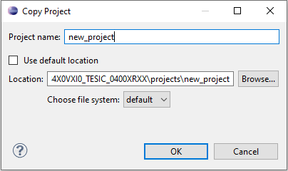

# Chip Support Package

This is a cross platform bare metal development environment which aims at being usable from command line and from IDEs like Eclipse. An aditional goal is to observe the "DRY" principle ("Don't Repeat Yourself").

## Concepts

The folder containing this file is referred as `CSP_ROOT`

This package use several kind of targe identifiers, this section present them. 
A tool is able to test those identifiers via environment variables. Source code can do the same via defines. Those identifiers are also used to name the directories whithin the CSP package.

### SDK short names and long names
A target device in this package is a particular CPU inside a particular SOC.
A toolchain is usually tied to the CPU type and is agnosic to the SOC around however when it comes to londing a program in memory and communicated with the running program, the knownledge of the SOC does matter. To take this into account, a toolchain is identified using an "SDK short name" and a particular CPU in a particular SOC using an "SDK long name".
- SDK short name: exact type and version of the targeted CPU.
- SDK long name: 
    - SOC part number
    - Instance number of the targeted CPU
    - SDK short name of the targeted CPU  

### SDK generic names
Often the toolchain is the same regardless of the exact version of the targeted CPU. To take this into account we define variants of the SDK short names and long names which are generic: version numbers are omitted or replaced by "X".

## Installation
- Extract CSP package in a path without any space.
- See README.md within the folder dedicated to your target.

## Dependencies
### Python
All python scripts within the package are tested using Python 3.7 64 bit.

## Usage
`CSP_ROOT` folder contains one or more folders specific to a target. Each folder has the same structure and contains "launch scripts" at the top level.
When trying out a new package, we recommend to try the command line first.

All "launch scripts" take two positional arguements:
- SDK_ROOT
- SDK_SHORT_NAME

Reasonable defaults are provided but you may want something different. In this case you can either set them directly while calling the script or by setting them as environment variables.

No matter if you use command line or an IDE, all actions are performed by the makefile targets.

### Makefile targets

#### The `clean` target
Remove from disk all output files produced by other targets.

:warning: **WARNING**: `clean` erase everything under the directory `$BUILD_DIR/obj`.

#### The `build` target
Create the following files:
- .elf: the program image as an elf file
- .naked.elf: .elf stripped of unecessary symbols such as debug info
- .map: map file generated by linker
- .ihex: the program binary image as an "intel-hex" file
- .bin: the program binary image as a raw file
- .v: file to load a memory in verilog simulator
- .disassembly: disassembly of the full program
- .size: size report including debug sections
- .naked.size: actual size report

#### The `rebuild` target
Short cut for `clean build`. The first thing to try when you get unexpected results. 

:grimacing: **NOTE**: Under some circumstances even `rebuild` may fail despite a perfectly valid source tree. This is due to the dependency tracking mechanism. Try `rebuild` a second time, if it fails again then the source tree may not be that perfect.

#### The `load` target
Load `.ihex` file in memory. It triggers the `build` target if needed. 

If you want to just load the current `.ihex` without checking anything, use the `just_load` target.

#### The `run` target
Launch `<project_name>.py`. If it detects that the latest `ihex` as not been loaded, it triggers the `load` target (which may in turn launch the `build` target).

:grimacing: **NOTE**: Using that target does not guarantee that you have the latest `ihex` is running in your device. For example if you use `load` and then change the board connected to your computer and the use this target...

:heavy_check_mark: **NOTE**: Using `clean run` does guarantee that the latest `ihex` is running in your device.

If you want to just run the script without checking anything, use the `just_run` target.

### Command line

Environment verification:
- Run the `launch_shell` script (`launch_shell.bat` for Windows user).
    - You shall get a command line prompt and the current directory shall be the `projects` 
- Check the environment variables displayed.
    * The first 3 depends on the location of the "launch script", if they don't match your expectation then you are using the wrong "launch script" 
        - CSP_ROOT 
        - SDK_LONG_NAME_PREFIX
        - SDK_GENERIC_SHORT_NAME
    * The last 2 already presented in this section
        - SDK_SHORT_NAME: shall match the exact version of your target
        - SDK_ROOT: shall match the location of the SDK you want to use
- Check that all project build fine:

        all mk rebuild

- If everything goes well, it shall output "X projects processed" where X is the total number of project folders.

The `projects` folder contains one sub folder for each project and 3 scripts:
- all
- mk
- run

#### The `all` script
It applies a command to each project sequentially, stopping if any error happens. 

#### The `mk` script
It calls `make` for a particular project. Syntax:

    mk <project_name> [make arguments] 

#### The `run` script
It calls `python` for a particular project. Syntax:

    run <project_name> [project's script arguments]

The python script shall be exactly `<project_name>.py`.
By default python is launched in a new terminal, this allows to close the new terminal if for some reason the script is not responsive. If you whish to execute within the main terminal, use the following syntax:

    run --nowin <project_name> [project's script arguments]

#### Examples
All examples are independant and assume the current directory is `projects`.

- clean all projects:
        
        all mk clean

- clean "project1" project:

        mk project1 clean

- clean, build, load and run "project1":

        mk project1 clean run

- clean, build, load and run "project1", second variant:

        mk project1 rebuild run

- force to build and run with DEBUG defined:

        mk project1 rebuild run DEBUG=1

- override arguments for the python script

        mk project1 run RUN_ARGS=first second third

- launch python script directly, skipping make

        run project1 first second third

:heavy_check_mark: **NOTE**: as projects are sub folders you can you tab completion. The trailing slash is tolated by the scripts.

### Eclipse IDE
Start eclipse using the dedicated "launch script".

Choose any location for the workspace, it may be an existing workspace with existing projects.

#### Importing projects
The projects need to be imported in your workspace:
- File ⟶ Import ...
    - General ⟶ Existing Projects into Workspace, ``Next >``
    - Select root directory: set this to the path of the `projects` folder
    - Select all projects you want to import, leave other check boxes unchecked, ``Finnish``

#### Launching make targets
As we do everything via makefile, we need to see the makefile targets available for each project.
- Window ⟶ Show View ⟶ Make Target

A window "Make Target" shall appear and display all projects which are open. 

:grimacing: **NOTE**: If it is empty, you need to "open" a project first (a project can be "imported" but "closed"). To open a project, use the "Project Explorer" window and double click on the desired project.

To launch a makefile target, use the "Make Target" window. Under the desired project you will see a list of targets, double click on the one you want to launch.

#### Creating a new project
The best way is to copy and past an existing project from the "Project Explorer":
- Copy the existing project by right click and select "Copy"
- Past the project by right click and selec "Past". Then the "Copy project" dialog pops up:
    + Set the new name
    + Uncheck "Use default location"
    + Browse to `projects` folder and create a folder with the same name as the new project

    + Leave the file system to "default" and press ``OK``
- Use the `clean` target. If for some reason some files remain in the build directory, delete them manually (can be done under eclipse).
- Open the makefile and change the variable "PROJECT_NAME"
- Change the name of the python script to match the new project name
- Finally change the build directory to the new location:
    -  Go to project properties (select the project and <kbd>Alt</kbd>+<kbd>Enter</kbd>)
    -  ``C/C++ Build``
    -  Select the "Builder Settings" tab
    -  Click on ``Workspace...`` button and select the new project. For a project named "new_project" you shall see "${workspace_loc:/new_project}" as "Build directory"
    -  If the project as several configurations, do the same for all

#### Limitations
The console window does not allow you to send data to the device. If your python script requires user interaction, launch it using an external console created with `launch_shell`, see [Command line](#user-content-command-line).
